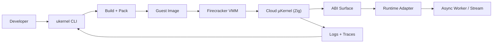

# MVP Architecture Overview (Draft v0.1)

This document ties together the ABI, Firecracker integration, and DX plan into a single MVP architecture view.

## MVP intent

Build a post-Linux guest kernel that runs inside Firecracker, executes real workloads (async workers first), and ships with a flox-like developer experience. The kernel is minimal, composable, and adapter-first for Python/Go/TypeScript while enabling native Rust/Zig paths later.

## System layers

### 1) Developer Experience Layer

- CLI (`ukernel`) manages projects, envs, builds, packaging, and local runs.
- Reproducible environment model and deterministic lockfiles.
- Logs, traces, and performance metrics are first-class.

Reference: `docs/dx-blueprint.md`

### 2) Build + Packaging Layer

- Workload source is compiled or bundled.
- Adapter runtime is pulled or built per language.
- Output is a bootable guest image (rootfs + kernel binary + workload bundle).

Reference: `docs/dx-blueprint.md`

### 3) Host Control Plane (Linux)

- Runs Firecracker VMM.
- Manages VM lifecycle, networking, and log collection.
- No Linux syscalls are used in guest; Linux is only the host substrate.

Reference: `docs/firecracker-integration.md`

### 4) Guest Cloud µKernel (Zig)

- Minimal kernel with scheduler, async I/O, memory arenas, IPC.
- Explicit ABI is the only interface between guest and workloads.
- Adapter runtimes map language event loops into the ABI.

Reference: `docs/kernel-abi.md`

## Workload flow (async worker priority)

1. Developer runs `ukernel build` and `ukernel pack`.
2. Control plane launches Firecracker with the image.
3. µKernel boots and initializes drivers and scheduler.
4. Adapter runtime loads and starts the workload entrypoint.
5. Workload processes events via `io.poll`, `ipc.recv`, `net.recv`.

## MVP device model

- `virtio-net` for data plane.
- `virtio-block` for root image.
- `serial` for logs.

Optional future devices: `virtio-rng`, `virtio-balloon`, `virtio-vsock`.

## Key ABI surfaces used in MVP

- Task: `task.spawn`, `task.yield`, `task.sleep`
- I/O: `io.open`, `io.read`, `io.write`, `io.poll`
- IPC: `ipc.channel_create`, `ipc.send`, `ipc.recv`
- Networking: `net.socket`, `net.bind`, `net.connect`, `net.send`, `net.recv`
- Observability: `log.write`, `trace.span_begin`, `trace.event`

## Initial runtime adapters

- Python: embeds CPython and maps `asyncio` to `io.poll`.
- Go: hooks netpoll and runtime scheduler to µKernel task API.
- TypeScript: embeds Deno or V8 with bindings.

## Success criteria (MVP)

- Boot to workload start in microseconds to low milliseconds.
- Run a real async worker pipeline with clear logs and traces.
- Deterministic build + pack flow from CLI.
- Minimal, explicit ABI and stable device model.

## Risks and mitigations

- Runtime adapter complexity: start with Python only for the first demo.
- Networking and device driver scope: keep virtio minimal.
- DX scope creep: focus on `init`, `build`, `pack`, `run`, `logs`.

## Next milestones

- M1: Bootable µKernel with serial logs in Firecracker.
- M2: Async worker demo with IPC and basic networking.
- M3: Python adapter runtime with `asyncio` mapping.
- M4: CLI pipeline for build/pack/run.

